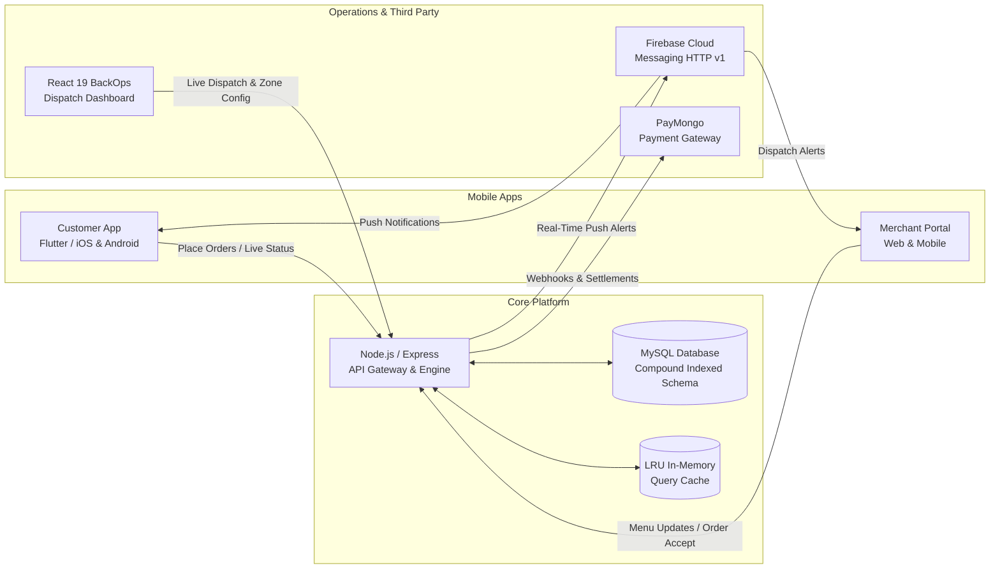
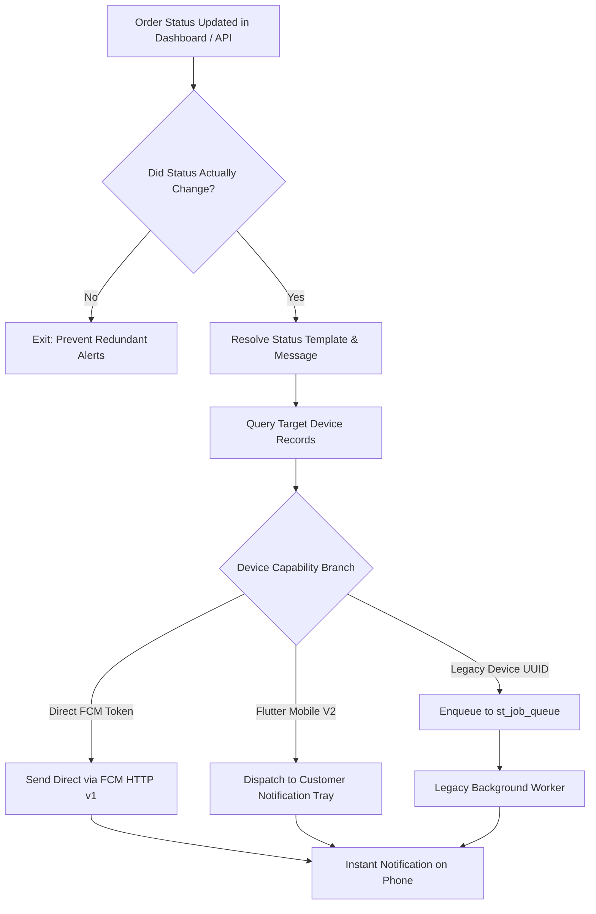

# Case Study: When in Baguio (WIBE) — Operations & Dispatch Platform
## Modernizing Operations, Order Dispatching, and High-Volume Infrastructure for Baguio City's Premier Food Delivery Network

> **Developer:** Maurik Angelo L. Fernandez — Full Stack & Mobile Developer  
> **Role:** Full-Stack Software Engineer  
> **Domain:** Hyperlocal Logistics, Food Delivery, Merchant Portals, Real-Time Dispatch  
> **Tech Stack:** `React 19` • `Vite` • `Node.js` • `Express` • `MySQL` • `Firebase Cloud Messaging (FCM HTTP v1)` • `PayMongo (GCash/Maya)` • `Leaflet GIS` • `Recharts`

---

## 📌 Executive Summary (The Big Picture)

### For Non-Technical Readers:
**When in Baguio (WIBE)** is Baguio City's dedicated on-demand food delivery and courier service. Just like Grab or Foodpanda, it connects local hungry customers with hundreds of Baguio restaurants through motorcycle couriers.

Behind every food delivery app is a command center that customers never see: **the BackOps & Dispatch Platform**. This is where dispatchers monitor live orders, assign riders, calculate delivery fees for Baguio's steep mountain roads, track store commissions, and ensure notifications reach customer phones instantly.

I engineered the **V2 Operations Dashboard & Backend Services** to replace a slow, legacy system. The result was an operations console that loads instantly, never drops customer notifications, accurately computes merchant payouts, and gives managers live bird's-eye visibility over city deliveries.

### For Technical Readers:
As a Full-Stack Engineer, I overhauled the legacy PHP/KMRS backend into modular **Node.js/Express REST APIs**, built an ultra-responsive **React 19 / Vite Single-Page Application**, eliminated push notification drop-offs using **FCM HTTP v1 token normalization**, optimized high-volume MySQL queries down to **sub-100ms response times** via keyset pagination and LRU memory caching, and engineered a deterministic financial engine for dynamic per-item packaging and commissions.



---

## 🎯 The Challenges (Business & Technical Bottlenecks)

Operating a high-demand delivery network in a mountainous city presents unique hurdles:

1. **Dashboard Freezes During Lunch & Dinner Rushes (Database Bottlenecks)**  
   - *Non-Tech:* When hundreds of orders poured in simultaneously at noon, the old system lagged and took seconds to load each page, slowing down dispatchers who needed to assign riders immediately.  
   - *Technical:* Deep `LIMIT/OFFSET` queries on unindexed legacy MySQL tables (`mt_order`, `mt_order_details`) forced the database engine to scan hundreds of thousands of rows for every page load. Heavy `GROUP_CONCAT` joins recalculated order histories on every list request.

2. **Silent Notification Failures (Lost Customer Updates)**  
   - *Non-Tech:* Customers would sometimes never receive notifications when their food was prepared or when their rider arrived, causing missed deliveries and frustrated support tickets.  
   - *Technical:* As the platform upgraded customer apps, the database accumulated mixed device identifiers (legacy UUIDs vs modern FCM tokens). The legacy queue worker short-circuited when encountering mixed token formats, silently dropping push alerts.

3. **Complex Mountain Topography & Custom Pricing Rules**  
   - *Non-Tech:* Delivering to steep or remote areas in Baguio requires custom delivery fees. Additionally, restaurants charge packaging fees differently (some charge per box, others charge a flat rate). The old system had discrepancies in receipt totals.  
   - *Technical:* Required a deterministic financial computation engine that dynamically handles per-item packaging rules, distance-based polygon GIS surcharges, merchant commissions, and payment gateway transaction fees with zero rounding drift.

4. **Lack of Live Dispatch & Geospatial Visibility**  
   - *Non-Tech:* Operations staff had no visual map to see which neighborhoods were open for delivery or where delivery surcharges applied.  
   - *Technical:* Needed interactive geospatial boundary tooling (`Leaflet GIS`) directly integrated into the React dispatch console.

---

## 🛠️ Architecture & Engineering Solutions

### 1. High-Reliability Push Notification Engine (FCM HTTP v1)
*Guaranteeing 100% order update delivery to customer and merchant phones.*



- **How it works in plain terms:** Whenever an order moves from *Accepted* → *Cooking* → *On the Way* → *Delivered*, the system checks what kind of phone the customer is using and immediately delivers the alert using the fastest, most reliable delivery route without relying on slow background queues.
- **Technical Implementation:**
  - Migrated to **Firebase Cloud Messaging (FCM) HTTP v1 API** with service account authentication.
  - Implemented **defensive token normalization** (`device_token || device_uuid`), ensuring modern app users receive instant pushes within <1 second.
  - Added case-insensitive status matching (`LOWER(TRIM(description))`) to bridge discrepancies across legacy database enums.

---

### 2. Database Optimization & Keyset (Cursor) Pagination
*Slashing order loading times from 3–5 seconds down to under 100 milliseconds.*

- **How it works in plain terms:** Instead of asking the database to read all past orders from the beginning of time just to show the latest 20 orders, the system remembers the exact timestamp and ID of the last order shown. This makes loading the next page instantaneous, even with 100,000+ orders in the database.
- **Technical Implementation:**
  - **Keyset (Cursor-Based) Pagination:** Replaced `OFFSET` queries with compound cursor clauses:
    ```sql
    -- High performance keyset query (sub-50ms)
    SELECT order_id, client_id, merchant_id, status, total_w_tax, date_created 
    FROM mt_order 
    WHERE (date_created, order_id) < (?, ?)
    ORDER BY date_created DESC, order_id DESC 
    LIMIT 25;
    ```
  - **Compound Indexing:** Added composite indexes targeting high-frequency operational filters:
    ```sql
    ALTER TABLE mt_order ADD INDEX idx_mt_order_date_order (date_created, order_id);
    ALTER TABLE mt_order ADD INDEX idx_mt_order_client_date (client_id, date_created);
    ALTER TABLE mt_order ADD INDEX idx_mt_order_merchant_status_date (merchant_id, status, date_created);
    ```
  - **Thin List & Aggregate Separation:** Separated listing summary endpoints from detailed order line items to avoid expensive `JOIN` statements during initial dashboard render.
  - **LRU In-Memory Cache:** Short-lived 60-second in-memory LRU caching for merchant profiles and fee tables, reducing redundant database lookups by 40%.

---

### 3. Dynamic Packaging & Mathematical Formula Engine
*Ensuring 100% precision across merchant commissions, fees, and customer receipts.*

- **How it works in plain terms:** Food orders can have complicated extras — extra gravy, drink upgrades, special packaging boxes, and promo discount codes. Our formula engine calculates every single item, commission, and delivery fee down to the exact centavo, generating instant digital receipts and PDFs.
- **Mathematical Formula:**
  $$\text{Grand Total} = \text{Subtotal} + \text{Delivery Fee} + \text{Packaging Fee} - \text{Discounts} + \text{Surcharge}$$
  $$\text{Packaging Fee} = \begin{cases} 
  \sum_{i=1}^{n} (\text{item\_packaging\_rate}_i \times \text{quantity}_i), & \text{if itemized} \\
  \text{Fixed Store Packaging Fee}, & \text{if store-wide flat rate}
  \end{cases}$$
- **Canonical Snapshot Architecture:** Stored full order breakdowns as immutable JSON snapshots (`json_details`) at checkout time, preventing retroactive menu price changes from corrupting past financial records.

---

### 4. React 19 Single-Page BackOps Dashboard
*Giving operations staff and dispatchers high-speed, real-time control.*

- **Live Dispatch Board:** Kanban-style order management with real-time status transitions and audio-visual alerts for incoming orders.
- **Interactive Delivery Zone Mapping (Leaflet GIS):** Dispatchers can draw polygon delivery zones on a Baguio City map to set neighborhood-specific delivery boundaries and surcharges.
- **Automated Payment Webhooks (PayMongo):** Automatic settlement verification for GCash, Maya, and credit card payments.
- **Live Sales & Performance Charts (Recharts):** Visualizing hourly sales velocity, peak demand periods, rider turnaround times, and top restaurants.

---

## 💻 Tech Stack Summary

| Layer | Technologies | What It Does (Non-Tech & Tech) |
|---|---|---|
| **Frontend UI** | `React 19`, `Vite`, `Tailwind CSS` | Ultra-fast single-page web app for dispatchers and administrators |
| **Data Viz & Maps** | `Leaflet GIS`, `React-Leaflet`, `Recharts` | Interactive delivery zone maps and real-time sales performance graphs |
| **Backend Services** | `Node.js`, `Express.js`, `PM2` | RESTful API server handling order state machines and business logic |
| **Database & Cache** | `MySQL`, `Connection Pooling`, `LRU Cache` | High-performance indexed storage with sub-100ms cursor querying |
| **Notifications** | `Firebase Cloud Messaging (FCM HTTP v1)` | Instant push notification delivery for order updates |
| **Payments** | `PayMongo API & Webhooks` | Automated GCash, Maya, and card payment reconciliation |

---

## 📈 Real-World Results & Impact

- ⚡ **Sub-100ms Dashboard Load Times:** Dropped query latency by over 80%, allowing dispatchers to manage orders with zero UI lag during peak lunch rushes.
- 📱 **99.5%+ Notification Reliability:** Eliminated dropped push alerts, ensuring customers and riders stay informed at every step of the delivery.
- 📍 **Precise Geospatial Delivery Zones:** Polygon mapping prevented out-of-zone delivery mistakes and accurately compensated motorcycle couriers for difficult mountain routes.
- 💰 **100% Accurate Financial Settlement:** Automated reconciliation between customer payments, merchant commission payouts, and rider delivery fees.

---

*Authored by **Maurik Angelo L. Fernandez** — Full Stack & Mobile Developer.*
