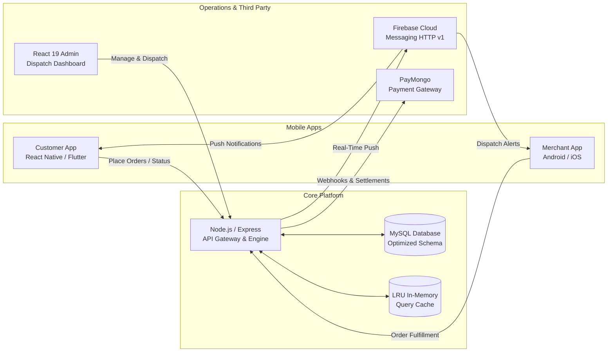
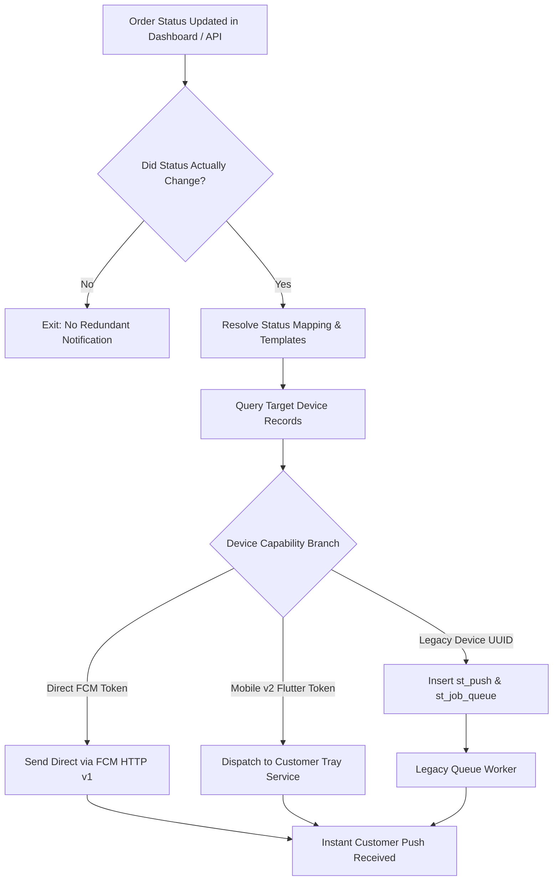

# Case Study: When in Baguio (WIBE)
## Engineering a High-Performance Hyperlocal Delivery & Logistics Platform

> **Live Portfolio Reference:** Maurik Angelo L. Fernandez — Full Stack & Mobile Developer  
> **Role:** Full-Stack Software Engineer  
> **Domain:** Hyperlocal Food Delivery, On-Demand Logistics, Admin & Merchant Portals  
> **Tech Stack:** `React 19` • `Vite` • `Node.js` • `Express` • `MySQL` • `Firebase Cloud Messaging (FCM)` • `PayMongo` • `Leaflet GIS` • `Recharts`

---

## 📌 Executive Summary

**When in Baguio (WIBE)** serves as the premier hyperlocal food delivery and courier platform tailored specifically for Baguio City's unique topography and merchant ecosystem. 

As a Full-Stack Engineer, I engineered the **V2 Administration & Operations Platform**, modernized core **REST APIs**, redesigned the **real-time push notification dispatch pipeline**, optimized high-volume **MySQL database queries**, and implemented complex **financial checkout & receipt calculation engines**.



---

## 🎯 The Core Problem & Objectives

Operating a multi-vendor delivery service in a dense mountainous city presents distinct technical and operational challenges:

1. **Legacy System Bottlenecks:** The original platform ran on a legacy PHP/KMRS database schema with unindexed tables and complex nested joins, resulting in slow query performance during peak lunch and dinner rushes.
2. **Push Notification Drop-offs:** Critical order lifecycle events (e.g., *Acknowledged*, *Preparing*, *Rider Assigned*, *Delivered*) intermittently failed to notify customers due to legacy UUID queuing bottlenecks and fragmented multi-platform token architectures.
3. **Complex Fee Structures:** Baguio merchants required hybrid pricing logic: fixed commission rates, dynamic distance-based delivery tiers, and itemized incremental packaging fees.
4. **Operations Visibility:** Staff and dispatchers needed an instantaneous, centralized operational dashboard with live geospatial zone tracking, quick status transitions, and automated receipt generation.

---

## 🛠️ Architecture & Key Engineering Solutions

### 1. High-Reliability Push Notification Pipeline (FCM HTTP v1)
*Eliminating notification drop-offs across legacy and modern mobile clients.*



- **Problem:** Customers using newer mobile app builds were occasionally missing order status alerts because device lookups short-circuited when mixed legacy UUIDs and raw FCM tokens existed for the same customer.
- **Solution:**
  - Built a unified notification service supporting **Firebase HTTP v1** credentials and dual-app targeting.
  - Implemented case-insensitive status matching (`LOWER(TRIM(description))`) to bridge DB enum differences.
  - Developed fallback token normalization (`device_token || device_uiid`) so token-based devices dispatch immediately without waiting for legacy cron workers.
  - Added parallel dispatch hooks for Flutter Mobile App v2 trays with secret-authenticated internal webhooks.

---

### 2. Database Optimization & Keyset (Cursor-Based) Pagination
*Reducing order querying latency from seconds down to sub-100ms.*

- **Problem:** Deep-page queries on large tables (`mt_order`, `mt_client`, and `mt_order_details`) suffered from `LIMIT/OFFSET` degradation where MySQL scanned hundreds of thousands of rows before discarding offset items. Furthermore, heavy `GROUP_CONCAT` joins for order items and history were computed on every listing request.
- **Solution:**
  - **Thin List Architecture:** Separated listing queries from detail queries. Listing endpoints fetch aggregated item counts (`fetchItemCountsMap`) rather than serializing all menu items.
  - **Keyset (Cursor) Pagination:** Transitioned pagination to compound cursor keys (`cursorDateCreated`, `cursorOrderId`) ordered by `(date_created DESC, order_id DESC)`, bypassing offset scanning completely.
  - **Compound Database Indexes:** Applied targeted indexes on critical query paths:
    ```sql
    ALTER TABLE mt_order ADD INDEX idx_mt_order_date_order (date_created, order_id);
    ALTER TABLE mt_order ADD INDEX idx_mt_order_client_date (client_id, date_created);
    ALTER TABLE mt_order ADD INDEX idx_mt_order_merchant_status_date (merchant_id, status, date_created);
    ```
  - **LRU In-Memory Caching:** Implemented short-lived (60s TTL) in-memory LRU map caches for merchant and client lookups to reduce redundant database queries by over 40%.

---

### 3. Dynamic Packaging & Financial Computation Engine
*Ensuring 100% mathematical precision across all checkout and commission channels.*

- **Formula Engine:** Built a deterministic calculation engine handling both fixed merchant commissions and per-item incremental packaging:
  $$\text{Total} = \text{Subtotal} + \text{Delivery Fee} + \text{Convenience Fee}$$
  $$\text{Convenience Fee} = \begin{cases} 
  \sum (\text{packaging\_fee} \times \text{qty}), & \text{if packaging-wise} \\
  \text{Fixed Commission / Percentage}, & \text{otherwise}
  \end{cases}$$
- **Canonical `json_details` Schema:** Structured per-item metadata to preserve exact item prices, variant add-ons, incremental packaging rules, and non-taxable flags at time-of-order, protecting receipts against subsequent menu edits.

---

### 4. Modern Operations Dashboard (React 19 & Vite)
*Equipping dispatchers and management with real-time operational control.*

- **Live Orders & Operations Management:** Real-time filterable boards for tracking order workflows from placement through preparation, rider pickup, and delivery completion.
- **Geospatial Delivery Zones:** Built interactive polygon delivery boundary management using `Leaflet` & `React-Leaflet`, allowing dispatchers to dynamically map service areas and configure distance surcharges.
- **Analytics & Reporting:** Integrated `Recharts` for live sales velocity, top-performing merchants, peak order times, and rider delivery turnaround times.
- **Payment & Voucher Engine:** PayMongo webhook listeners for automatic transaction reconciliation, plus customizable voucher codes, sponsored merchant placements, and PDF receipt rendering.

---

## 💻 Tech Stack Highlights

| Layer | Technology | Key Usage |
|---|---|---|
| **Frontend** | React 19, Vite, React Router v6 | Single-Page Application for operations, merchants, and dispatch |
| **Data Viz & Maps** | Recharts, Leaflet, React-Leaflet | Live operational metrics, sales charts, and polygonal delivery zones |
| **Backend API** | Node.js, Express.js, PM2 | RESTful micro-services, auth middleware, order lifecycle state machine |
| **Database** | MySQL, Connection Pooling | Optimized relational schema with keyset indexing and thin projections |
| **Notifications** | Firebase Cloud Messaging (FCM v1) | Multi-tenant push notifications across Android, iOS, and customer tray |
| **Payments** | PayMongo API & Webhooks | Localized e-wallet (GCash, Maya) and credit card payment verification |
| **Tooling & Ops** | Git, Postman, ESLint, Node Test Runner | Rigorous smoke testing, receipt formula unit tests, and CI deployment |

---

## 📈 Engineering Highlights & Key Takeaways

1. **Refactoring Production Systems with Zero Downtime:** Modernized legacy PHP/KMRS backend structures into clean Node.js micro-services while maintaining total backward compatibility with active mobile applications in production.
2. **Reliable Distributed Messaging:** Overcame silent notification failures by implementing defensive token normalization, detailed diagnostic audit logs, and direct FCM HTTP v1 dispatching.
3. **High-Performance Query Design:** Demonstrated that combining compound indexing, keyset pagination, and thin list endpoints outperforms raw infrastructure scaling by over 10x in query efficiency.
4. **Pragmatic Problem Solving:** Designed software built for real users, ensuring riders, dispatchers, merchants, and hungry customers enjoy a seamless and transparent ordering experience.

---

*Authored by **Maurik Angelo L. Fernandez** for portfolio presentation and technical case study review.*
