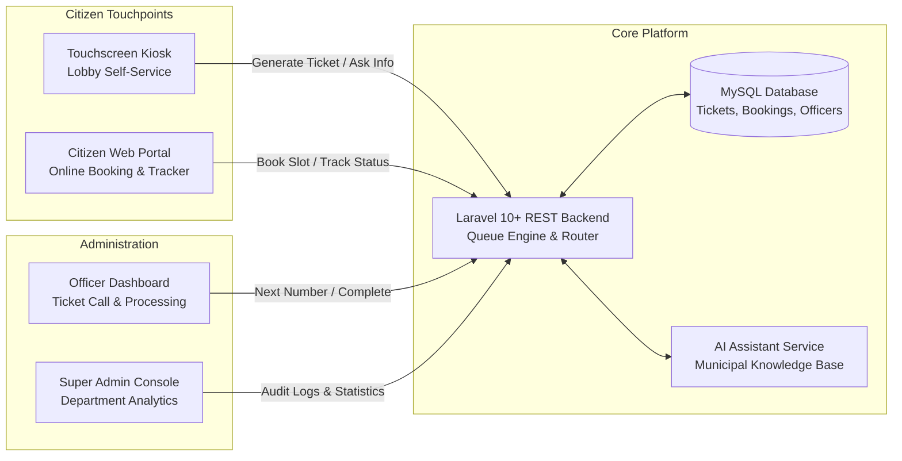

# Case Study: CLICK2SERVE — Smart Municipal Information Kiosk
## AI-Assisted Municipal Information, Self-Service Kiosk, and Queue Management System for Local Government

> **Developer:** Maurik Angelo L. Fernandez — Full Stack & Mobile Developer  
> **Role:** Full-Stack Web & Kiosk Developer  
> **Domain:** Civic Technology, Smart City, Self-Service Kiosks, Public Service Automation  
> **Tech Stack:** `Laravel (PHP)` • `MySQL` • `JavaScript (Vanilla / ES6)` • `Tailwind CSS` • `3D Interactive Maps` • `AI Chatbot Integration`

---

## 📌 Executive Summary (The Big Picture)

### For Non-Technical Readers:
Visiting a city hall or municipal office in the Philippines can often be confusing and time-consuming. Citizens frequently stand in long lines just to ask basic questions like *"Where do I pay my business permit?"*, *"What documents do I need for a barangay clearance?"*, or *"Which room is the Assessor's Office on the 3rd floor?"*

**CLICK2SERVE** was built to solve this exact problem. It is a smart, touchscreen kiosk and companion web portal deployed in city hall lobbies. Citizens can tap through guided municipal services, ask an AI assistant questions in plain language, explore an interactive 3D floor map of the building, book appointments online, and track their live queue number from their smartphones — drastically reducing waiting room congestion and staff workload.

### For Technical Readers:
I designed and developed full-stack modules for CLICK2SERVE using **Laravel (PHP)** and **MySQL**, connected to a responsive, high-resolution touch interface. The platform features role-based access control (Super Admin, Municipal Officer, Citizen), interactive 3D department mapping, an NLP-powered FAQ chatbot, a dynamic ticket queue state machine, and real-time appointment booking workflows.

---

## 🎯 The Problems & Challenges

1. **Long Hallway Lines for Basic Information**  
   - *Non-Tech:* Front-desk officers spent hours answering the exact same repetitive questions about requirements, fees, and office locations rather than processing official documents.  
   - *Technical:* Lack of a centralized, search-indexed municipal knowledge repository with conversational self-service endpoints.

2. **Confusion Navigating Multi-Story Government Buildings**  
   - *Non-Tech:* Visitors struggled to find specific departmental windows across multiple floors, resulting in missed appointments and wandering in restricted areas.  
   - *Technical:* Needed an interactive, lightweight 3D floor plan visualizer accessible on both public touchscreens and low-bandwidth mobile browsers.

3. **Chaotic Queue Management & Crowded Waiting Areas**  
   - *Non-Tech:* Citizens had to sit in cramped waiting areas for hours listening for their number to be shouted, with no way to know estimated wait times.  
   - *Technical:* Implemented a synchronized ticket state machine where queue updates are tracked across public kiosk display boards, officer desks, and personal mobile tracker URLs.

---

## 🛠️ Key Engineering Solutions & Architecture

### 1. Kiosk Touch Interface & Service Request Engine (Laravel + Vanilla JS)
- Built high-contrast, large-target touchscreen UI components optimized for diverse age groups and screen accessibility.
- Implemented step-by-step document requirement checklists with QR codes allowing citizens to scan and save requirements straight to their phones.

### 2. Live Queue State Machine & Officer Dispatch Dashboard
- Developed a transactional queue management workflow:
  $$\text{Ticket Lifecycle: } \text{Created} \longrightarrow \text{Called} \longrightarrow \text{In Progress} \longrightarrow \text{Completed / Transferred}$$
- Provided department officers with a clean single-click dashboard to call next tickets, mark requirements checked, and transfer citizens between connected offices.

### 3. Interactive 3D Municipal Building Navigation
- Integrated interactive 3D map views that visually guide citizens floor-by-floor to the exact room, window, or counter they need.

### 4. AI-Powered Municipal FAQ Chatbot
- Integrated an intelligent municipal assistant that answers common civic queries in English and Tagalog (e.g., civil registry, real estate tax, business permits) 24/7 without staff intervention.

---

## 💻 Tech Stack Overview

| Layer | Technology | Key Responsibility |
|---|---|---|
| **Backend & ORM** | `Laravel (PHP)`, `Eloquent ORM` | Business logic, queue state engine, authentication, and REST APIs |
| **Database** | `MySQL` | Relational storage for tickets, appointment slots, requirements, and audits |
| **Frontend UI** | `HTML5`, `Tailwind CSS`, `JavaScript (ES6)` | Touch-optimized kiosk UI and responsive citizen web portal |
| **Maps & Media** | `3D Floorplan Canvas`, `QR Code Generator` | Interactive facility navigation and mobile transfer codes |
| **AI Integration** | `NLP Assistant Gateway` | Instant answering of citizen inquiries with municipal knowledge base |

---

## 📈 Real-World Impact

- 🏛️ **Streamlined City Hall Inquiries:** Reduced front-desk repetitive inquiry bottlenecks by providing self-service information.
- ⏱️ **Organized Queue Flow:** Real-time mobile ticket tracking allowed citizens to grab a coffee or wait outside while monitoring their queue position.
- 📱 **Omnichannel Access:** Seamlessly linked the physical lobby kiosk with the online web portal, allowing residents to book at home or walk in directly.

---

*Authored by **Maurik Angelo L. Fernandez** — Full Stack & Mobile Developer.*
