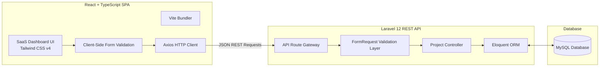

# Case Study: ProjeX — Client Engagement & Project Management Platform
## Decoupled SaaS Dashboard Engineered with Laravel 12, React, TypeScript, and Tailwind CSS

> **Developer:** Maurik Angelo L. Fernandez — Full Stack & Mobile Developer  
> **Role:** Full-Stack Web Developer  
> **Type:** Technical Assessment / SaaS Application  
> **Tech Stack:** `Laravel 12 (REST API)` • `PHP 8.2+` • `React` • `TypeScript` • `Vite` • `Tailwind CSS v4` • `MySQL` • `Axios`

---

## 📌 Executive Summary (The Big Picture)

### For Non-Technical Readers:
Managing multiple freelance or client projects often gets messy when using bloated enterprise tools like Jira or scattered spreadsheets. 

**ProjeX** is a clean, modern project management dashboard built for agencies, consultants, and teams. It provides a simple, beautiful interface to track client engagements, assign priorities (Low, Medium, Urgent), monitor project deadlines, update statuses, and prevent tasks from falling through the cracks.

### For Technical Readers:
ProjeX is engineered using a clean, **fully decoupled architecture**: a headless **Laravel 12 REST API backend** with strict server-side `FormRequest` validation, paired with a type-safe **React 18 + TypeScript single-page application** powered by **Vite** and **Tailwind CSS v4**. It features instant client-side input validation, optimistic UI feedback, robust error boundary states, and full CRUD capabilities via an **Axios HTTP client**.

---

## 🛠️ Key Engineering Features

1. **Decoupled Architecture (REST API + React SPA):** Clean separation between backend data modeling and frontend view rendering.
2. **Dual-Layer Validation:** Immediate visual feedback in the browser + strict, secure server-side validation rules in Laravel to ensure database integrity.
3. **Type Safety with TypeScript:** Explicit interfaces for project models, client details, priorities, and status lifecycles to prevent runtime errors.
4. **SaaS-Style Micro-Interactions:** Polished status and priority badge system, animated modal dialogues, inline search and filtering, and graceful empty/loading states.

---

*Authored by **Maurik Angelo L. Fernandez** — Full Stack & Mobile Developer.*
