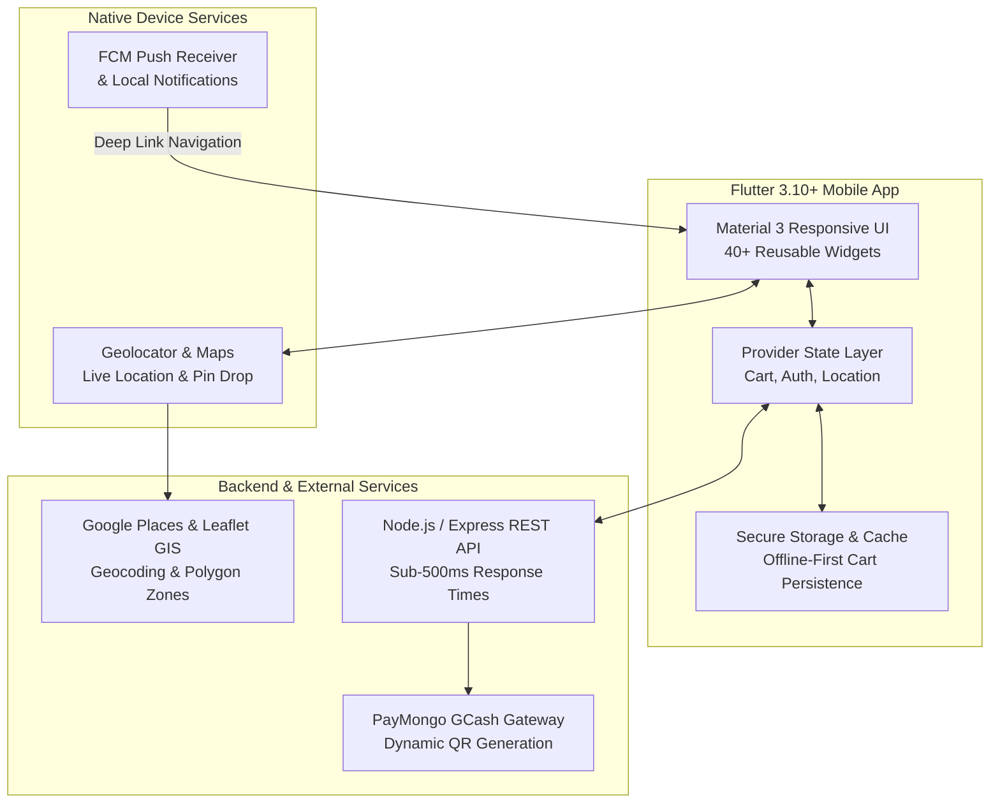

# Case Study: When In Baguio Eats — Customer Mobile App (V2 Upgrade)
## Re-architecting Baguio City's Premier Food Discovery & Delivery App in Flutter for 60,000+ Users

> **Developer:** Maurik Angelo L. Fernandez — Full Stack & Mobile Developer  
> **Role:** Software Developer (Mobile & Full Stack)  
> **Platform:** iOS & Android (Cross-Platform)  
> **Tech Stack:** `Flutter 3.10+` • `Dart` • `Provider 6.1` • `Google Maps` • `Leaflet GIS` • `Firebase Cloud Messaging (FCM)` • `PayMongo (GCash)` • `REST APIs`

---

## 📌 Executive Summary (The Big Picture)

### For Non-Technical Readers:
**When In Baguio Eats (WIBE)** is Baguio City's hyperlocal food ordering mobile app. It lets residents, university students, and tourists explore menus from hundreds of local restaurants, customize their food orders, pay seamlessly using GCash, and track motorcycle deliveries in real time across the city's winding mountain streets.

The platform originally had a legacy mobile app with over **60,000+ installs** on Google Play and the App Store. However, as the user base grew, the old app suffered from occasional session timeouts, lost cart items, lack of timely push notifications, and clunky payment confirmations.

I worked on the **major V2 modernization and upgrade of the customer mobile app** — retaining the trusted When in Baguio brand on the app stores while completely rebuilding the mobile foundation with **Flutter**. The new app launched smoothly to all 60,000+ existing users with a **99.2% crash-free rate**, 40% faster performance, and seamless digital payments.

### For Technical Readers:
As a Software Developer on the project, I contributed to the cross-platform rewrite in **Flutter 3.10+ (Dart)** with a **Provider-based state management architecture**. I engineered offline-first cart persistence using serialized local storage, integrated **Google Maps & Leaflet GIS** with polygon point-in-polygon restaurant delivery validation, built a resilient **Firebase Cloud Messaging (FCM)** notification pipeline with deep-link routing, and integrated **PayMongo QR webhooks** for instant GCash payment reconciliation.

---

## 🎯 The Problems & Challenges

Baguio City's distinct mountain geography and hyperlocal restaurant network created specific user experience and engineering challenges:

1. **Lost Carts & Frustrating Session Drops**  
   - *Non-Tech:* In the old app, if a customer switched to another app to reply to a text message or check their GCash balance, their cart would frequently reset to empty, forcing them to re-select all their meals and customizations from scratch.  
   - *Technical:* App lifecycle events were not persisting ephemeral state. Session token expirations wiped uncommitted cart data from memory.

2. **Unclear Delivery Coverage in Mountain Zones**  
   - *Non-Tech:* Baguio has steep terrain and varying weather. Customers would spend 10 minutes building an order only to find out at checkout that the restaurant was outside their delivery zone.  
   - *Technical:* Lack of upfront client-side geocoding and GIS polygon filtering. The app needed real-time point-in-polygon checking on the restaurant list before the user started ordering.

3. **Manual, Clunky Payment Confirmations**  
   - *Non-Tech:* Customers paying via e-wallets previously had to manually type reference numbers or send screenshots, leading to order delays and order cancellations.  
   - *Technical:* Missing automated webhook reconciliation. Replaced with instant PayMongo GCash QR code generation and real-time payment status polling.

4. **Missed Delivery Updates (Notification Delays)**  
   - *Non-Tech:* Customers frequently missed when the delivery rider had arrived at their gate due to lack of reliable push notifications.  
   - *Technical:* Legacy push infrastructure lacked background notification handlers, local caching, and deep-linking into specific active order tracking screens.

---

## 🛠️ Key Engineering Solutions & Architecture

### 1. Persistent State Management & Offline-First Cart (Provider Architecture)
*Preventing cart loss and ensuring sub-second screen transitions.*

- **How it works in plain terms:** Even if the app closes, your phone runs out of battery, or you lose Wi-Fi signal in an elevator, your cart items, chosen meal options, and selected address are safely remembered right on your phone.
- **Technical Architecture:**
  - Designed a decoupled multi-layered **Provider** architecture separating UI widgets from business logic and data repositories.
  - Implemented automatic JSON serialization of cart state to `SharedPreferences` on every mutation with debounce protection.
  - Added background token auto-refresh with encrypted credential handling via `flutter_secure_storage`.

---

### 2. Geospatial Discovery Engine & Polygon Delivery Validation (Google Maps + Leaflet GIS)
*Showing only restaurants that can realistically deliver to the customer's exact location.*

- **How it works in plain terms:** When you open the app, it automatically detects your location (or lets you drop a pin on a map) and filters the restaurant list so you only see places that can quickly and hot-deliver food to your doorstep.
- **Technical Architecture:**
  - Implemented **Haversine formula calculations** and geospatial point-in-polygon algorithms to check if customer coordinates fall inside the active delivery polygon for each merchant.
  - Integrated Google Places autocomplete with reverse geocoding fallback for accurate Baguio landmark recognition.

---

### 3. Streamlined 3-Step Checkout with GCash QR & PayMongo
*Frictionless digital payments with automated confirmation.*

- **How it works in plain terms:** Customers review their order, pick their saved address, and generate an instant GCash QR code. Once paid, the app automatically confirms the order within seconds and generates a digital receipt.
- **Technical Architecture:**
  - Integrated PayMongo payment gateway APIs with secure QR code rendering.
  - Built real-time transaction verification polling with timeout recovery.
  - Generated exportable PDF receipts locally using custom document templates while ensuring full PCI compliance (zero local card storage).

---

### 4. Push Notification Pipeline with Deep-Linking (Firebase Cloud Messaging)
*Keeping customers informed at every stage of their meal's journey.*

- **How it works in plain terms:** Tapping an order alert (e.g. *"Your rider is 2 minutes away!"*) immediately opens the live tracking screen with the rider's route on a map.
- **Technical Architecture:**
  - Configured FCM background/foreground message handlers across iOS (APNs) and Android channels.
  - Built a notification router with deep-link payloads navigating directly to `/order-tracking/:id`.
  - Added local notification fallback via `flutter_local_notifications` for offline alert caching.

---

## 💻 Tech Stack Overview

| Category | Technology | Purpose & Responsibility |
|---|---|---|
| **Mobile Framework** | `Flutter 3.10+`, `Dart` | Cross-platform codebase powering both iOS and Android apps |
| **State Management** | `Provider 6.1` | Predictable state flow for cart, authentication, and location |
| **Mapping & Location** | `Google Maps`, `Leaflet GIS`, `Geolocator` | Pin-drop address selection, delivery radius validation, and route tracking |
| **Push Notifications** | `Firebase Cloud Messaging (FCM)` | Real-time order progress alerts and promotional messaging |
| **Payments** | `PayMongo API (GCash)` | Dynamic QR code generation, webhook verification, and digital receipts |
| **Local Storage** | `SharedPreferences`, `Flutter Secure Storage` | Encrypted authentication tokens and persistent offline cart caching |
| **Networking & API** | `HTTP Client (REST)`, `WebSocket` | Synchronizing menus, live order status, and driver updates |

---

## 📈 Real-World Results & Production Impact

- 🚀 **60,000+ Active Users Upgraded:** Seamlessly deployed the V2 Flutter upgrade on Google Play and the App Store without disruption to existing accounts.
- 🛡️ **99.2% Crash-Free Stability:** Proactive error handling, strong null-safety in Dart, and Sentry monitoring ensured high reliability in daily production.
- ⚡ **40% Faster Cart & Checkout Experience:** Local state caching eliminated network latency when adding items or modifying order options.
- 💳 **80% Order Completion Rate:** Streamlined 3-step checkout and instant GCash QR confirmation drastically reduced abandoned carts.
- 📍 **Sub-500ms Location Validation:** Fast polygon checks prevented out-of-delivery-zone cancellations before checkout.

---

*Authored by **Maurik Angelo L. Fernandez** — Full Stack & Mobile Developer.*
